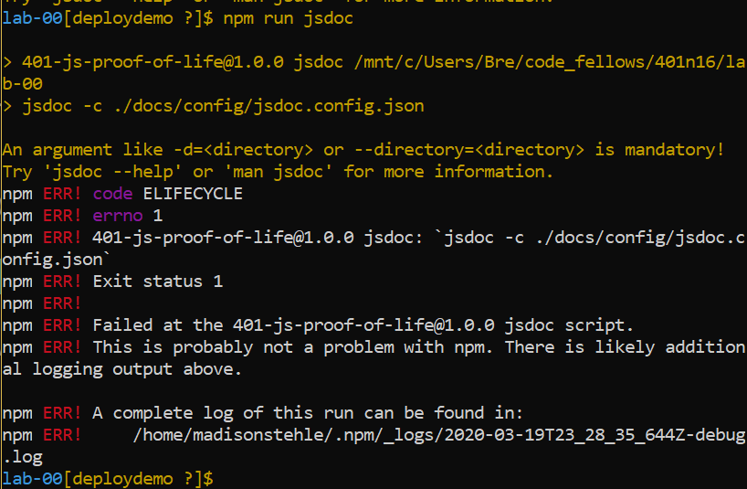

# LAB - 00

## Proof of Life Server

### Author: Madison Stehle

### Links and Resources

- [submission PR](https://github.com/401-advanced-javascript-madisonstehle/lab-00/pulls?q=is%3Apr+is%3Aclosed)
- [ci/cd](https://github.com/401-advanced-javascript-madisonstehle/lab-00/actions) (GitHub Actions)
- [front-end server](https://madisonstehle-lab-00.herokuapp.com/) (when applicable)

### Documentation
I could not get JSDoc to work. I installed locally and globally and I could not shake this error.

### Modules
#### `pol.js`

### Setup
#### `.env` requirements (where applicable)

- `PORT` - 3000

#### How to initialize/run your application (where applicable)
- `npm start`
- Endpoint: '/'
  - Returns a boolean

#### How to use your library (where applicable)
#### Tests

- Unit tests: `npm test`
- Lint Tests: `npm run lint`

#### UML

Link to an image of the UML for your application and response to events
